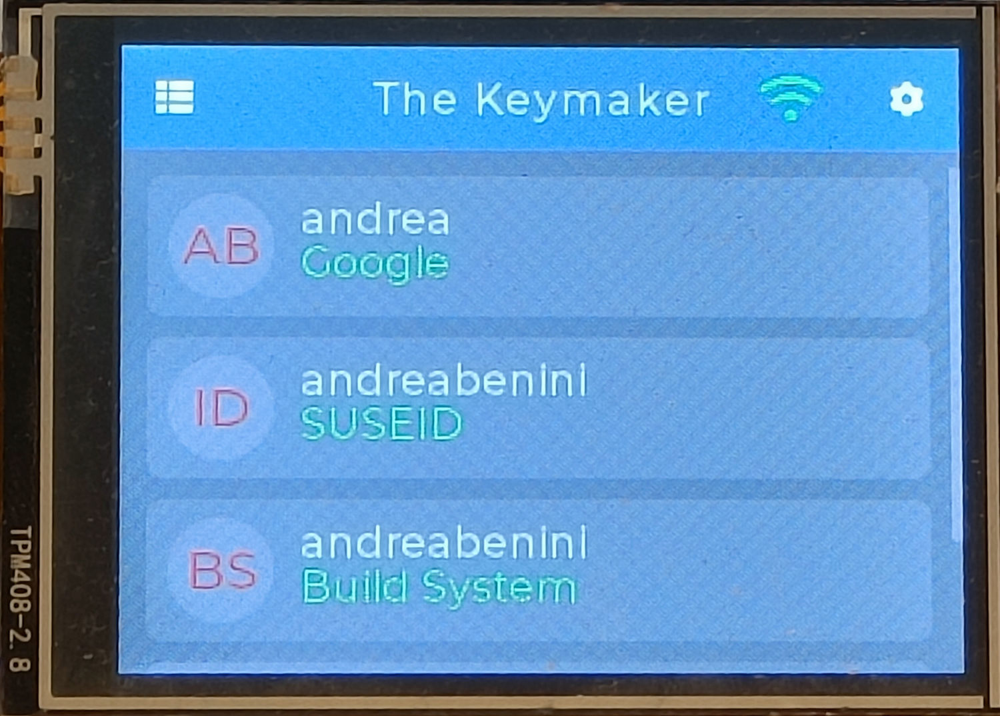
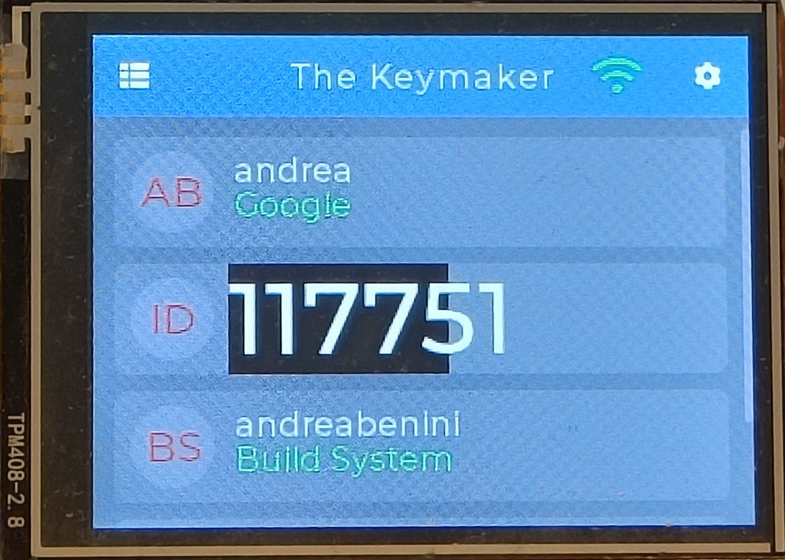

# The Keymaker
**Your 2FA codes, on your desk. Not in the cloud, not on your phone.**

Keymaker turns a ESP32 touchscreen board (the infamous *Cheap Yellow Display*) into a standalone
TOTP/HOTP authenticator. Punch in your PIN, tap an account, read the code. That's the whole ritual.  
No app store. No account. No sync service. No telemetry. Your secrets never leave the device, and
they sit in flash encrypted with a key that only exists while your finger is on the screen.

[](LICENSE)
[](docs/SETUP.md)
[](https://docs.espressif.com/projects/esp-idf/)
[](https://docs.lvgl.io/8.3/)

<p align="center">
  
  
</p>
<p align="center"><em>Your accounts, and a code you can actually read from across the desk.</em></p>


## Why bother
Phone authenticators are fine until you drop the phone in a lake, or until the vendor decides your
seeds belong in their cloud. A dedicated device fixes both problems: it does one job, it has no
browser, no notifications and no attack surface worth the name, and when you want to know what it's
doing you can read every line of the firmware.  
_It also happens to be a great excuse to build something :)_


## What it does
- **TOTP and HOTP**, RFC compliant, HMAC-SHA1, 6 or 8 digits, custom periods
- **Up to 20 accounts**, sorted the way you want them
- **PIN lock on boot**, up to 10 digits, on a keypad big enough for real fingers
- **Encrypted storage**. Secrets are sealed with AES-256-GCM; the key is derived from your PIN with
  PBKDF2-HMAC-SHA256 over 100,000 iterations and a random salt. The PIN is not a door you can walk
  around, it *is* the key. Without it, flash is noise.
- **Web setup**. The device raises its own access point and shows a QR code, you scan it, land on a
  captive portal and paste your `otpauth://` URI straight from Google Lens or any QR reader
- **NTP time sync** over WiFi, because TOTP without the right clock is just random numbers
- **Touch calibration** on first boot, stored in NVS, survives a reflash
- **A case**, ready to print, in [box/](box)

WiFi is only used for the setup portal and for keeping the clock honest. There is no server on the
other end.


## Get one running
### The short way, prebuilt firmware
Grab the release package, plug the board in, run the installer. It builds a Python venv, pulls
esptool, finds your device and flashes it.
```sh
./install.sh
```
Full walkthrough, permissions and port troubles included, in the
[installation guide](contrib/INSTALL.md).

### The fun way, from source
```sh
# Point this at your own ESP-IDF install
. $HOME/.espressif/v5.5.3/esp-idf/export.sh

idf.py build
idf.py -p /dev/ttyUSB0 flash monitor
```
First boot asks you to tap four corners for touch calibration, then to pick a PIN. After that, open
the settings gear, join your WiFi, and start adding accounts.


## Hardware
Anything sold as a "CYD" with the 2.8" display should work.

| Part    | Detail                              |
| ------- | ----------------------------------- |
| Board   | ESP32-WROOM-32                      |
| Display | 2.8" ILI9341, 320x240, SPI          |
| Touch   | XPT2046 resistive, SPI              |
| Extras  | MicroSD slot, RGB LED, light sensor |

Pinout and wiring live in the [setup guide](docs/SETUP.md). If the display fights you, the
[display configuration reference](docs/DISPLAY_CONFIG.md) is the map out of that maze.


## Built with
ESP-IDF 5.5.3 (native Espressif, no Arduino layer), LVGL 8.3 for the interface, FreeRTOS underneath.
UI cues borrowed with gratitude from [FreeOTP](https://github.com/freeotp/freeotp-android).


## On security, honestly
The [security document](docs/SECURITY.md) does not oversell this project. It walks through what is
protected, what is not, how a dumped flash chip could be attacked, and what flash encryption and
secure boot would buy you. It also says plainly when you should buy a FIPS certified token instead
of building one. Read it before you trust the device with anything that matters.


## Documentation
- [Setup guide](docs/SETUP.md), build steps, pinout, first boot
- [Installation guide](contrib/INSTALL.md), for flashing the released firmware
- [Security recommendations](docs/SECURITY.md), threat model and hardening
- [Display configuration](docs/DISPLAY_CONFIG.md), the reference you will need eventually
- [VSCode setup](docs/VSCODE.md), editor and ESP-IDF integration
- [Changelog](CHANGELOG.md)


## License
Dual licensed.
1. **GPLv3** for hobbyists, makers and open source projects.
2. **Commercial** for hardware vendors, resellers and closed source integrations where GPLv3 does
   not fit.

Contact [andreabenini](https://github.com/andreabenini) to discuss commercial or royalty free
licensing for your hardware.


## Support the project
Keymaker is free and it stays free. Keeping it that way still costs evenings, hardware and coffee.
If it saved you time, solved a problem, or ended up on your desk, consider chipping in.  
Free options work too: star the repo so others find it, open an issue when something breaks, tell
someone who owns a spare CYD about it.

[](https://github.com/sponsors/andreabenini)
[](https://paypal.me/bendonations)