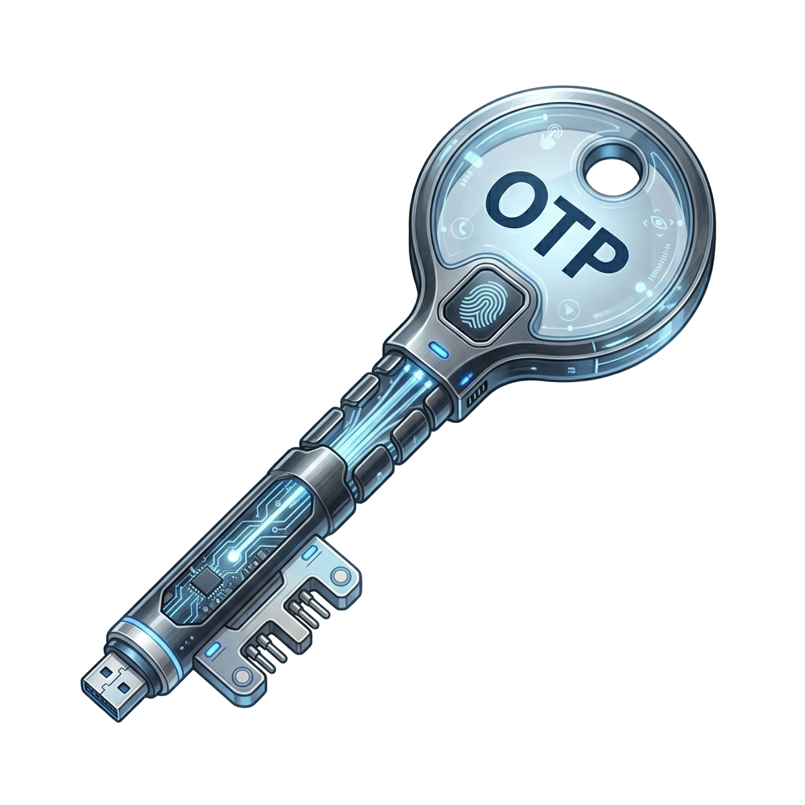

# Keymaker - ESP32 OTP Authenticator
A two-factor authentication application for ESP32 (CYD - Cheap Yellow Display) using one-time password protocols.

## Quick Start

```bash
# Setup environment, adapt it to your current path
. $HOME/.espressif/v5.5.3/esp-idf/export.sh

# Build and flash
idf.py build
idf.py -p /dev/ttyUSB0 flash monitor
```

## Documentation [README.md](https://github.com/andreabenini/keymaker/blob/main/README.md)
All links are referred from this URL
- **[Official readme](README.md)** - This document
- **[Setup Guide](docs/SETUP.md)** - Build instructions, hardware pinout, architecture overview
- **[Installation guide](contrib/INSTALL.md)** - Installation guide, also distributed in the binary package
- **[Changelog](CHANGELOG.md)** - Project changelog
- **[Security recommendations](docs/SECURITY.md)** - Never, ever, take security for granted in a OTP device.
A deep analysis, project implementations and why you should pick this project among others. Security
considerations or why you should prefer a FIPS compliant device if you work for a government institution instead.
- **[Display configuration reference](docs/DISPLAY_CONFIG.md)** - A mess to configure for a starter, a good reference later
- **[vscode setup](docs/VSCODE.md)** - Nice to have setup guide for VisualStudioCode + Espressif SDK (ESP-IDF)

## Hardware
**Platform**: ESP32-WROOM-32 (CYD - Cheap Yellow Display)
- **Display**: 2.8" ILI9341 TFT (320x240, SPI)
- **Touch**: XPT2046 resistive (SPI)
- **Additional**: MicroSD, RGB LED, LDR

## Framework
- **ESP-IDF 5.5.3** (native Espressif framework, no Arduino)
- **LVGL 8.3** (GUI library)
- **FreeRTOS** (real-time operating system)

## License
Keymaker is dual-licensed:
1. **Open Source:** For hobbyists, makers, and open-source projects, it is available under the **GNU General Public License v3.0 (GPLv3)**.
2. **Commercial:** For hardware vendors, sellers, or corporate integrations where GPLv3 compliance is not possible (e.g., closed-source proprietary products), a **Commercial License** IS required.

Please contact the creator of this repository [andreabenini] to discuss commercial licensing or to purchase a royalty-free license for your hardware.


## Support the Project
This project is open-source and free to use. However, maintaining the codebase, fixing bugs, and
developing new features requires a significant investment of time and effort.  
If this tool has saved you time, solved a problem, or helped your business, please consider supporting
its continued development. Your contributions help ensure the project remains active and sustainable!

[](https://github.com/sponsors/andreabenini)
[](https://paypal.me/bendonations)
#### Other ways to help
- **Star the repo** to help others find the project
- **Open an issue** if you find a bug or have a feature request
- **Spread the word** by sharing the project with your network
